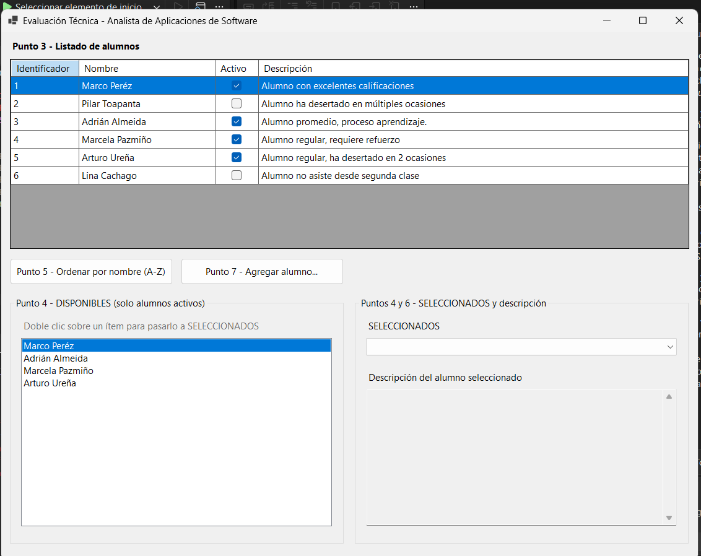
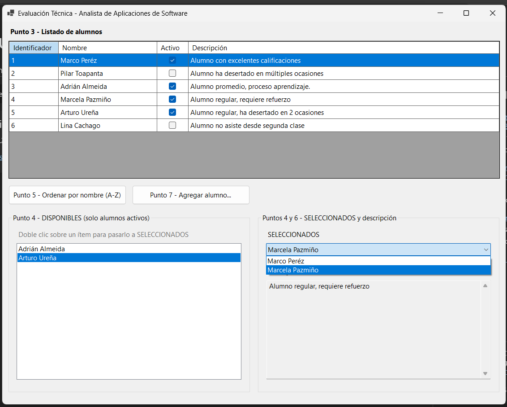
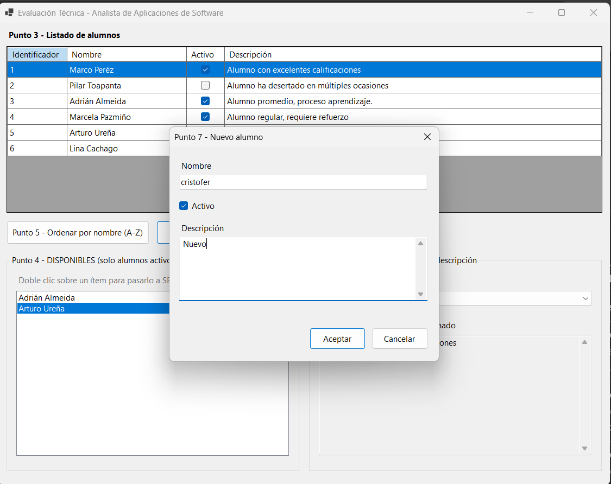
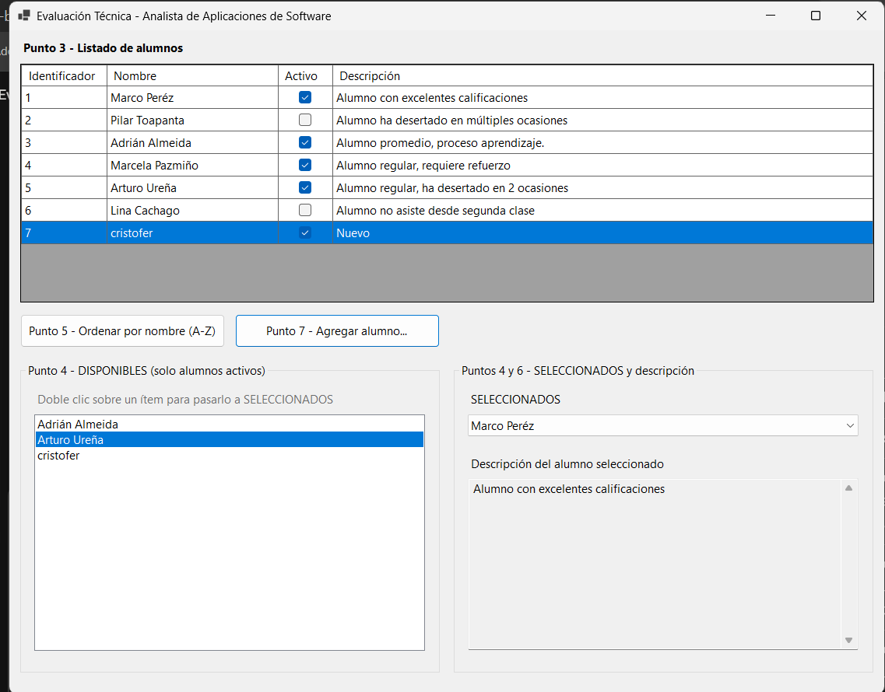

# Evaluación Técnica — Analista de Aplicaciones de Software

Solución a la evaluación técnica: modelo de datos y consulta SQL de cartera
(punto 1) y aplicación de escritorio en C# / Windows Forms (puntos 2 al 7),
organizada con arquitectura hexagonal (puertos y adaptadores).

---

## Requisitos

- Windows
- .NET 10 SDK
- Visual Studio 2026 (opcional; la solución también corre desde consola)
- SQL Server, SQL Server Express o LocalDB para la parte de base de datos

## Cómo ejecutar

**Desde Visual Studio:** abrir `Alumnos.sln`, marcar `Alumnos.UI.WinForms` como
proyecto de inicio (clic derecho → Establecer como proyecto de inicio) y pulsar F5.

**Desde consola:**

```
dotnet run --project src\Alumnos.UI.WinForms
dotnet test
```

La aplicación no requiere base de datos: los datos iniciales provienen del
adaptador de persistencia en memoria.

---

## Funcionamiento

### Al iniciar el programa (puntos 3 y 4)



El Grid View se carga automáticamente con los seis alumnos definidos. En paralelo,
la lista **DISPONIBLES** se llena únicamente con los alumnos activos: aparecen
cuatro de los seis, porque Pilar Toapanta y Lina Cachago están inactivos. Ese
filtro se resuelve con LINQ en la capa de aplicación, no en el formulario.

### Traspaso de elementos y descripción (puntos 4 y 6)



Al hacer doble clic sobre un nombre en DISPONIBLES, el alumno pasa al ComboBox
**SELECCIONADOS** y desaparece de la lista de disponibles. En la captura ya se
trasladaron Marco Peréz y Marcela Pazmiño, por lo que en DISPONIBLES quedan solo
Adrián Almeida y Arturo Ureña.

Al elegir un alumno en el ComboBox, el TextBox inferior muestra su descripción.

### Alta de nuevos elementos (punto 7)



El botón "Agregar alumno" abre un formulario que captura nombre, estado y
descripción. El identificador no se pide: lo asigna el sistema. El formulario
valida antes de aceptar y no permite nombres de menos de tres caracteres.



El alumno nuevo entra al Grid View con el identificador 7 y, por estar activo,
también se incorpora a la lista DISPONIBLES. Esa coherencia entre ambas vistas
la mantiene la capa de aplicación.

### Ordenamiento (punto 5)

El botón reordena el Grid View alfabéticamente por nombre y alterna entre
ascendente y descendente en cada pulsación.

---

## Arquitectura

```
                    +---------------------------+
   Adaptadores      |      Alumnos.Dominio      |      Adaptador
   de entrada       |                           |      de salida
                    |   Entidad: Alumno         |
  UI.WinForms  ---> |   Puertos:                | <--- Infraestructura
  Pruebas      ---> |     IGestionAlumnos       |      (repositorio
                    |     IAlumnoRepositorio    |       en memoria)
                    +---------------------------+
                                 ^
                                 |
                       Alumnos.Aplicacion
                    (implementa los casos de uso)
```

| Proyecto | Rol | Depende de |
|---|---|---|
| `Alumnos.Dominio` | Entidad y puertos | **nada** |
| `Alumnos.Aplicacion` | Casos de uso | Dominio |
| `Alumnos.Infraestructura` | Adaptador de salida (persistencia) | Dominio |
| `Alumnos.UI.WinForms` | Adaptador de entrada (interfaz gráfica) | Aplicación, Infraestructura |
| `Alumnos.Pruebas` | Adaptador de entrada (automatizado) | Aplicación, Infraestructura |

La regla que sostiene el diseño: **el proyecto de dominio no referencia a ningún
otro**. Todas las dependencias apuntan hacia el centro.

### Cómo fluye una operación

Al hacer doble clic sobre un alumno en DISPONIBLES:

1. `FrmPrincipal` detecta el evento y consulta al puerto de entrada:
   `_gestion.PuedeSeleccionarse(alumno, _seleccionados)`.
2. `GestionAlumnosServicio` aplica la regla (no repetir identificadores) y responde.
3. El formulario mueve el elemento entre las colecciones enlazadas.

El formulario pregunta; el servicio decide. Ninguna regla de negocio vive en la
capa de presentación.

### Por qué esta arquitectura

El enunciado admite una solución de un solo proyecto. Se optó por separar en
capas por dos razones concretas:

1. **La lógica se verifica sin interfaz gráfica.** El proyecto de pruebas ejercita
   el filtro de activos, el ordenamiento, la validación de duplicados y las reglas
   de alta sin abrir una sola ventana.
2. **Cambiar el origen de datos no toca la aplicación.** El repositorio en memoria
   implementa `IAlumnoRepositorio`. Uno contra SQL Server ocuparía su lugar
   modificando únicamente estas dos líneas de `Program.cs`:

```csharp
IAlumnoRepositorio repositorio = new AlumnoRepositorioEnMemoria();
IGestionAlumnos gestion = new GestionAlumnosServicio(repositorio);
```

Esa es la única parte del sistema que conoce implementaciones concretas.

### Decisiones puntuales

- **La entidad `Alumno` es inmutable y se crea mediante fábrica.** El constructor
  es privado y `Alumno.Crear` valida, de modo que no puede existir un alumno en
  estado inválido.
- **El dominio no implementa `INotifyPropertyChanged`.** Esa interfaz pertenece al
  enlace de datos, que es una preocupación de la presentación; incluirla
  contaminaría el núcleo con detalles de interfaz gráfica.
- **Ordenamiento con `StringComparer.CurrentCulture`.** El comparador ordinal por
  defecto ubica incorrectamente tildes y Ñ; con el comparador de cultura, "Ureña"
  queda en su posición correcta del alfabeto español.
- **LINQ en los casos de uso, no en el formulario.** El filtro de activos y el
  ordenamiento viven en el servicio, de modo que la interfaz solo presenta.

---

## Punto 1 — Base de datos

Motor: SQL Server. Ejecutar los scripts de la carpeta `sql/` en orden:

1. `01_esquema.sql` — tablas `TipoGarantia`, `Credito` y `CuotaCredito`.
2. `02_datos_prueba.sql` — datos que cubren las cinco bandas de mora.
3. `03_consulta_bandas.sql` — la consulta solicitada.

La sucursal forma parte de la llave primaria en `Credito` y `CuotaCredito`, tal
como indica el enunciado; por eso las relaciones se establecen por el par
(`NumeroCredito`, `Sucursal`) y no solo por el número de crédito.

Las cinco bandas se obtienen con `SUM(CASE WHEN ...)` en un único recorrido de la
tabla, en lugar de cinco consultas unidas por `UNION`. Los días vencidos se
calculan con `DATEDIFF`, y `CAST(GETDATE() AS DATE)` evita que la hora del día
distorsione el resultado. El filtro `FechaVencimiento < hoy` descarta las cuotas
aún no vencidas.

Resultado esperado con los datos de prueba:

| 1–30 | 31–90 | 91–180 | 181–360 | +360 | Total |
|---|---|---|---|---|---|
| 250.00 | 450.00 | 650.00 | 850.00 | 500.00 | 2700.00 |

---

## Cobertura de los requerimientos

| Punto | Requerimiento | Ubicación |
|---|---|---|
| 1 | 3 tablas y consulta de bandas de mora | `sql/` |
| 2 | Clase con 4 propiedades | `Alumnos.Dominio/Entidades/Alumno.cs` |
| 3 | Grid View con 6 elementos al iniciar | `AlumnoRepositorioEnMemoria` + `FrmPrincipal_Load` |
| 4 | ListBox de activos hacia ComboBox por doble clic con LINQ | `ObtenerActivos`, `PuedeSeleccionarse` |
| 5 | Botón de orden alfabético por nombre | `OrdenarPorNombre` |
| 6 | TextBox con la descripción del seleccionado | `MostrarDescripcion` |
| 7 | Interfaz para agregar elementos al Grid View | `FrmNuevoAlumno` |
